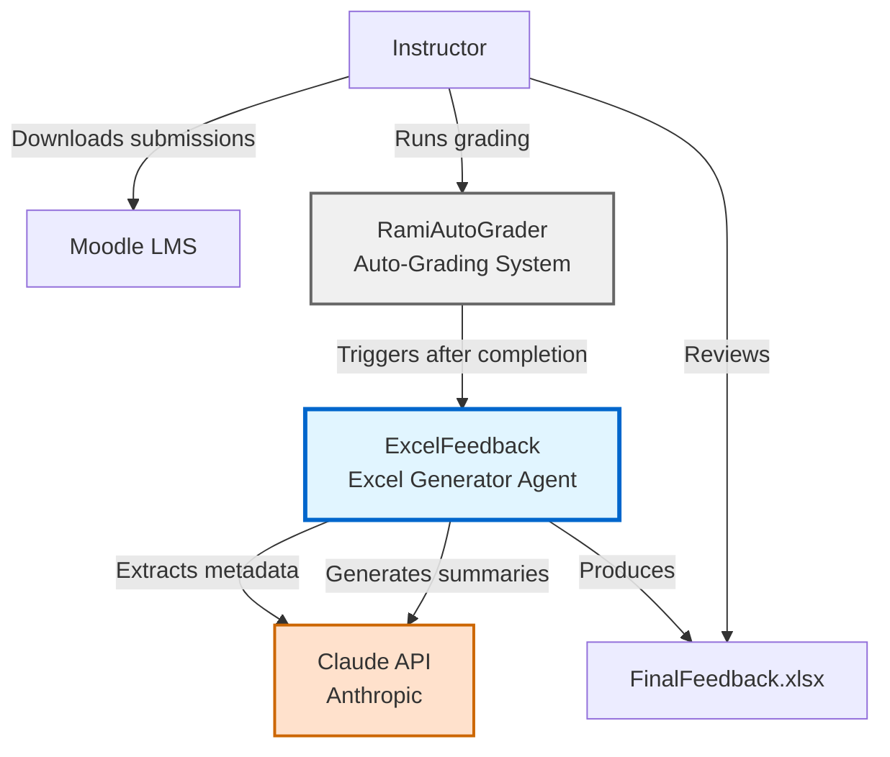
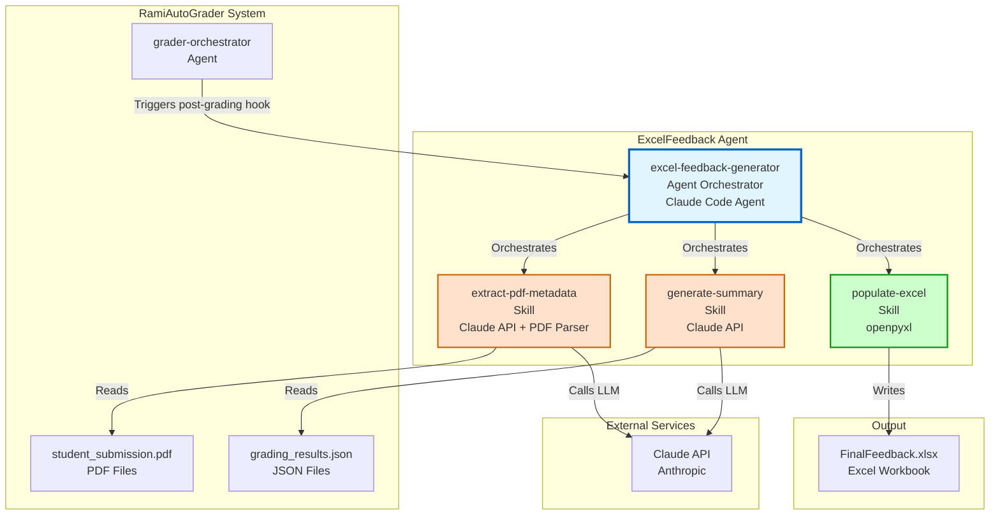
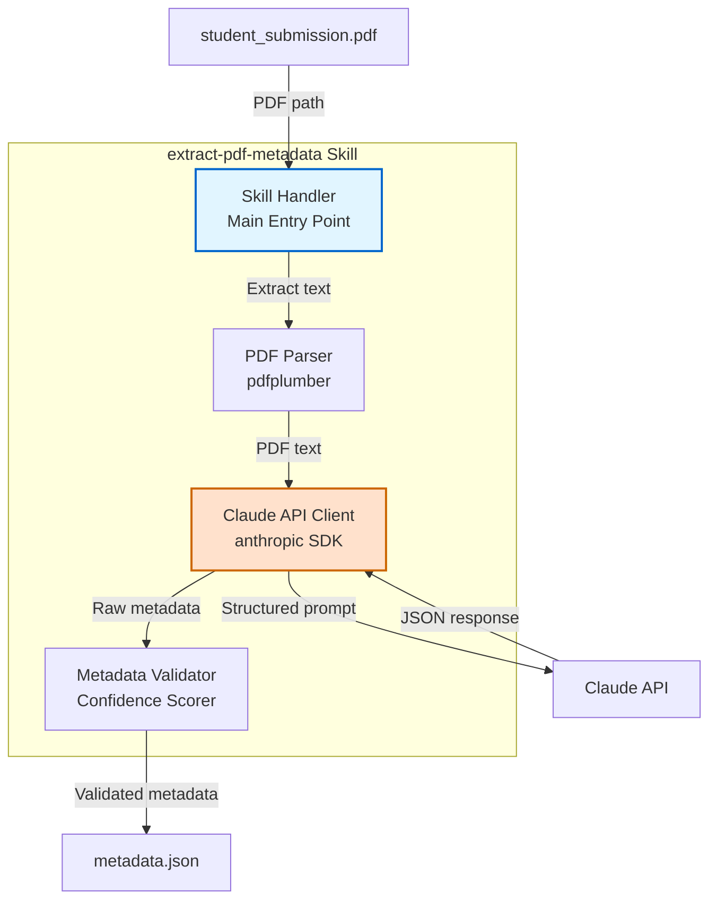
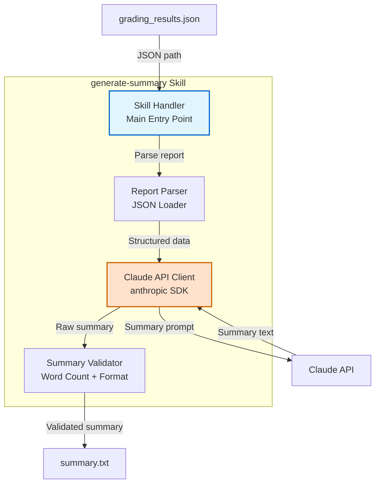
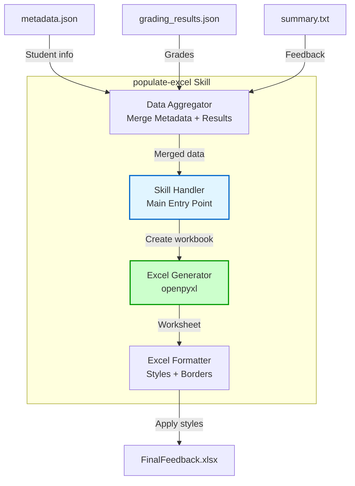
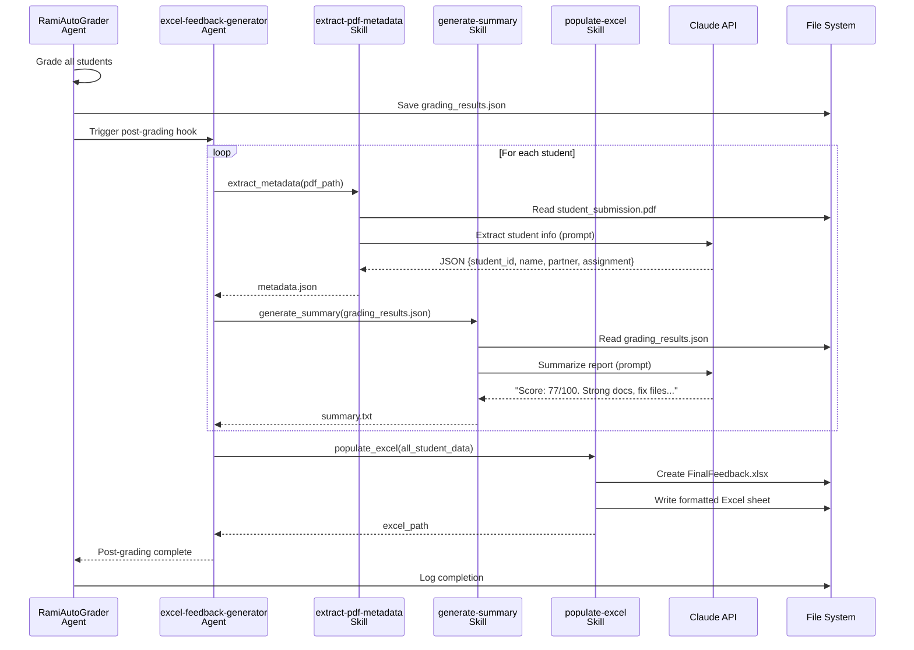
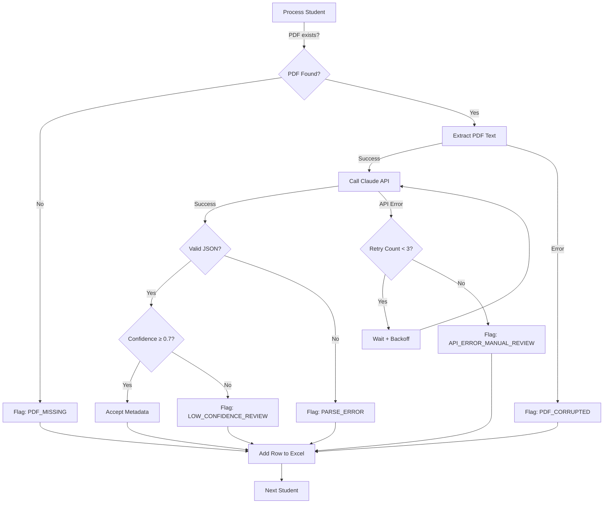

# PLANNING.md - ExcelFeedback Architecture & Design

## Project Overview

**ExcelFeedback** is a Claude Code agent that generates instructor-facing Excel feedback sheets after the RamiAutoGrader completes grading student submissions. It serves as the final layer that ties together the entire grading workflow.

**Key Decision**: Agent-based architecture (not Python script) for maximum flexibility and LLM integration.

---

## C4 Architecture Diagrams

### Level 1: System Context Diagram



**External Actors**:
- **Instructor**: Runs grading workflow, reviews final Excel feedback
- **Moodle LMS**: Source of student PDF submissions
- **Claude API**: LLM service for metadata extraction and summary generation

**System Boundary**:
- **ExcelFeedback Agent**: Orchestrates post-grading Excel generation
- **RamiAutoGrader**: Upstream grading system that triggers ExcelFeedback

---

### Level 2: Container Diagram



**Containers**:
1. **excel-feedback-generator Agent**: Main orchestrator
2. **extract-pdf-metadata Skill**: PDF → Student metadata (Claude API)
3. **generate-summary Skill**: Grading report → Concise summary (Claude API)
4. **populate-excel Skill**: All data → Formatted Excel file (openpyxl)

**Data Stores**:
- `grading_results.json`: Per-student grading output from RamiAutoGrader
- `student_submission.pdf`: Original PDF submissions
- `FinalFeedback.xlsx`: Final Excel workbook output

---

### Level 3: Component Diagram - extract-pdf-metadata Skill



**Components**:
- **Skill Handler**: Coordinates PDF reading, LLM extraction, validation
- **PDF Parser**: Extracts text from PDF using pdfplumber
- **Claude API Client**: Sends structured prompt, receives JSON response
- **Metadata Validator**: Validates fields, calculates confidence score

---

### Level 3: Component Diagram - generate-summary Skill



**Components**:
- **Skill Handler**: Coordinates report parsing, summary generation, validation
- **Report Parser**: Loads and parses `grading_results.json`
- **Claude API Client**: Sends summarization prompt, receives text
- **Summary Validator**: Ensures 30-50 words, professional tone, required elements

---

### Level 3: Component Diagram - populate-excel Skill



**Components**:
- **Skill Handler**: Coordinates data aggregation, Excel creation, formatting
- **Data Aggregator**: Merges metadata, grading results, summaries into rows
- **Excel Generator**: Creates workbook, adds rows using openpyxl
- **Excel Formatter**: Applies styles (fonts, colors, borders, column widths)

---

## Data Flow Diagram



**Key Phases**:
1. **Trigger**: RamiAutoGrader completes, triggers ExcelFeedback agent
2. **Metadata Extraction**: For each student, extract info from PDF using Claude
3. **Summary Generation**: For each student, summarize grading report using Claude
4. **Excel Generation**: Create formatted workbook with all data
5. **Completion**: Save Excel file, return control to RamiAutoGrader

---

## Architecture Decision Records (ADRs)

### ADR-001: Agent-Based Architecture vs Python Script

**Status**: ✅ Accepted

**Context**:
We need to generate Excel feedback sheets after auto-grading completes. Two architectural approaches considered:
1. Standalone Python script (traditional approach)
2. Claude Code agent orchestrating skills (modern approach)

**Decision**: Use Claude Code agent architecture

**Rationale**:
- **LLM Integration**: Native Claude API access for metadata extraction and summarization
- **Composability**: Skills can be reused in other contexts
- **Maintainability**: Clear separation of concerns (extract, summarize, populate)
- **Orchestration**: Agent handles workflow, retries, error handling automatically
- **No CLI Needed**: Triggered by post-grading hook, no manual execution

**Consequences**:
- **Positive**: Flexible, maintainable, leverages LLM capabilities
- **Positive**: Integrates seamlessly with RamiAutoGrader agent workflow
- **Negative**: Requires understanding of Claude Code agent architecture
- **Negative**: Slightly more complex setup than simple Python script

**Alternatives Rejected**:
- Python script with argparse CLI: Less flexible, harder to integrate with RamiAutoGrader
- Single monolithic skill: Less composable, harder to test

---

### ADR-002: Claude API for PDF Metadata Extraction

**Status**: ✅ Accepted

**Context**:
Student PDFs contain metadata (student ID, name, partner name, assignment name) in unstructured text. Need to extract this reliably. Options:
1. Regex patterns (brittle, requires exact formatting)
2. Named entity recognition (NER) models (complex, requires training)
3. Claude API with structured prompts (flexible, no training needed)

**Decision**: Use Claude API with structured extraction prompts

**Rationale**:
- **Flexibility**: Handles various PDF formats and layouts
- **Accuracy**: Claude's language understanding extracts data from unstructured text
- **Confidence Scoring**: Can assess extraction quality and flag low-confidence results
- **No Training**: Works immediately without labeled data
- **Error Handling**: Returns "NOT_FOUND" for missing fields

**Consequences**:
- **Positive**: High accuracy, handles edge cases, no regex maintenance
- **Positive**: Confidence scoring enables manual review workflow
- **Negative**: API cost per extraction (~$0.003 per student)
- **Negative**: Requires internet connectivity and API key

**Example Prompt**:
```markdown
Extract these fields from PDF text:
- student_id (8 digits)
- student_name (full name)
- partner_name (group project partner)
- assignment_name (assignment title)

Return JSON or "NOT_FOUND" for missing fields.
```

**Alternatives Rejected**:
- Regex patterns: Too brittle, fails with formatting variations
- NER models: Overkill, requires training data, less accurate for domain-specific fields

---

### ADR-003: Excel Format (.xlsx) vs CSV/JSON

**Status**: ✅ Accepted

**Context**:
Need to provide instructor-facing feedback in a readable format. Options:
1. CSV file (simple, widely supported)
2. JSON file (structured, machine-readable)
3. Excel (.xlsx) file (rich formatting, human-friendly)

**Decision**: Use Excel (.xlsx) format with rich formatting

**Rationale**:
- **Human-Friendly**: Instructors prefer Excel for reviewing tabular data
- **Rich Formatting**: Headers (bold, colored), borders, column widths, text wrapping
- **Hyperlinks**: GitHub URLs are clickable links (not plain text)
- **Sorting/Filtering**: Instructors can sort by grade, filter by notes
- **Familiarity**: Excel is the de facto standard for academic grading

**Consequences**:
- **Positive**: Excellent UX for instructors, professional appearance
- **Positive**: Supports advanced features (hyperlinks, conditional formatting)
- **Negative**: Slightly larger file size than CSV (~10KB vs 3KB for 30 students)
- **Negative**: Requires openpyxl library dependency

**Formatting Requirements**:
- Header row: Bold, light blue background (#D9E1F2), centered
- Borders: Thin borders on all cells
- Column widths: Auto-adjusted (Student ID: 12, Name: 20, Summary: 60)
- Text wrapping: Enabled for Summary column
- GitHub URL: Hyperlink formula `=HYPERLINK(url, "Link")`

**Alternatives Rejected**:
- CSV: No formatting, GitHub URLs not clickable, less professional
- JSON: Not human-friendly, requires tools to view

---

### ADR-004: Prompt-Based Skill Orchestration

**Status**: ✅ Accepted

**Context**:
Agent needs to orchestrate 3 skills (extract-pdf-metadata, generate-summary, populate-excel). How should skills be invoked and data passed? Options:
1. Direct function calls with parameters (code-based)
2. Prompt-based orchestration via agent.yaml (declarative)

**Decision**: Use agent.yaml with declarative workflow steps

**Rationale**:
- **Clarity**: Workflow visible in configuration, not buried in code
- **Maintainability**: Easy to modify workflow without changing code
- **Error Handling**: Agent framework handles retries, timeouts automatically
- **Traceability**: Agent logs show step-by-step execution
- **Best Practice**: Aligns with Claude Code agent architecture patterns

**Agent Workflow Example**:
```yaml
workflow:
  - step: extract_all_metadata
    skill: extract-pdf-metadata
    for_each: student_submission
    inputs:
      pdf_path: ${submission.pdf_path}
    outputs:
      metadata: ${student.metadata}

  - step: generate_all_summaries
    skill: generate-summary
    for_each: student_submission
    inputs:
      grading_report: ${submission.grading_results.json}
    outputs:
      summary: ${student.summary}

  - step: create_excel
    skill: populate-excel
    inputs:
      student_data: ${all_students}
    outputs:
      excel_path: ${output_path}
```

**Consequences**:
- **Positive**: Clear workflow definition, easy to understand
- **Positive**: Agent framework handles orchestration complexities
- **Negative**: Requires learning agent.yaml syntax
- **Negative**: Debugging may require inspecting agent logs

**Alternatives Rejected**:
- Code-based orchestration: Less declarative, harder to modify, more error-prone

---

### ADR-005: Confidence Scoring for Manual Review Flagging

**Status**: ✅ Accepted

**Context**:
PDF metadata extraction may fail or return low-quality results. Need a mechanism to flag uncertain extractions for manual review. Options:
1. Binary success/failure (all-or-nothing)
2. Confidence scoring (0.0-1.0) with threshold for flagging

**Decision**: Use confidence scoring with 0.7 threshold

**Rationale**:
- **Granularity**: Confidence score provides more information than binary flag
- **Flexibility**: Threshold can be adjusted based on accuracy needs
- **Workflow Integration**: Low-confidence extractions flagged in Excel "Notes" column
- **Transparency**: Instructor knows which records may need verification

**Confidence Calculation**:
```python
confidence = calculate_confidence(metadata)
# Factors:
# - All required fields present: +0.4
# - Valid student_id format (8 digits): +0.2
# - Valid name format (2+ words): +0.2
# - Valid assignment_name: +0.2

if confidence < 0.7:
    metadata["extraction_status"] = "NEEDS_MANUAL_REVIEW"
    excel_notes = "LOW_CONFIDENCE_REVIEW"
```

**Flagging Logic**:
- confidence ≥ 0.7: Accept, no flag
- confidence < 0.7: Accept but flag for review
- Extraction failure: Flag as "API_ERROR_MANUAL_REVIEW"
- Missing PDF: Flag as "PDF_MISSING"

**Consequences**:
- **Positive**: Balances automation with quality control
- **Positive**: Instructors have visibility into uncertain extractions
- **Negative**: Requires defining confidence calculation logic
- **Negative**: May require manual review for 10-20% of students

**Alternatives Rejected**:
- Binary success/failure: Less informative, may accept low-quality extractions
- No flagging: Risky, may propagate errors to final Excel without instructor awareness

---

### ADR-006: Post-Grading Hook Integration Point

**Status**: ✅ Accepted

**Context**:
ExcelFeedback agent needs to be triggered after RamiAutoGrader completes. Where should the integration point be? Options:
1. Manual execution after grading (instructor runs separately)
2. Post-grading hook in RamiAutoGrader agent.yaml (automatic trigger)

**Decision**: Use post-grading hook in RamiAutoGrader agent.yaml

**Rationale**:
- **Automation**: Instructor doesn't need to remember to run ExcelFeedback
- **Seamless Workflow**: Grading → Excel generation in single operation
- **Consistency**: Excel always generated with same data as grading
- **Error Prevention**: No risk of running Excel generation on stale data

**Implementation**:
```yaml
# RamiAutoGrader/agents/grader-orchestrator/agent.yaml
post_grading_steps:
  - agent: excel-feedback-generator
    trigger: after_all_students_graded
    inputs:
      grading_results_dir: ${output_dir}
      pdf_submissions_dir: ${pdf_dir}
      assignment_name: ${assignment_name}
    outputs:
      excel_file: results/FinalFeedback_${assignment_name}.xlsx
```

**Consequences**:
- **Positive**: Fully automated workflow, no manual steps
- **Positive**: Guaranteed consistency between grading and Excel
- **Negative**: Requires modifying RamiAutoGrader agent configuration
- **Negative**: ExcelFeedback errors may disrupt grading completion (mitigated by error handling)

**Error Handling**:
- ExcelFeedback failure should NOT fail entire grading workflow
- Log errors to `results/excel_generation_errors.log`
- Instructor can manually re-run ExcelFeedback if needed

**Alternatives Rejected**:
- Manual execution: Error-prone, inconsistent, requires instructor to remember
- Pre-grading hook: Wrong timing, grading results don't exist yet

---

## Technology Stack

### Core Technologies

| Component | Technology | Version | Purpose |
|-----------|-----------|---------|---------|
| Agent Framework | Claude Code | Latest | Agent orchestration |
| LLM | Claude Sonnet 4.5 | claude-sonnet-4-5-20250929 | Metadata extraction, summarization |
| PDF Parsing | pdfplumber | ≥0.10.0 | Extract text from PDFs |
| Excel Generation | openpyxl | ≥3.1.0 | Create formatted .xlsx files |
| Python | Python | ≥3.10 | Skill implementation |
| Testing | pytest | ≥7.0 | Unit and integration tests |
| API Client | anthropic | ≥0.40.0 | Claude API SDK |

### Dependencies

**`requirements.txt`**:
```txt
# Claude API
anthropic>=0.40.0

# PDF Processing
pdfplumber>=0.10.0
pikepdf>=8.0.0  # For hyperlink extraction

# Excel Generation
openpyxl>=3.1.0

# Utilities
python-dotenv>=1.0.0
pydantic>=2.0.0  # For data validation

# Testing
pytest>=7.0.0
pytest-cov>=4.0.0
pytest-mock>=3.12.0
```

---

## Deployment Architecture

### Directory Structure (Post-Deployment)

```
RamiAutoGrader/
├── agents/
│   └── grader-orchestrator/
│       └── agent.yaml  # ← Modified with post_grading_steps
│
├── ExcelFeedback/  # ← New directory
│   ├── agents/
│   │   └── excel-feedback-generator/
│   │       ├── agent.yaml
│   │       └── README.md
│   ├── skills/
│   │   ├── extract-pdf-metadata/
│   │   │   ├── SKILL.md
│   │   │   ├── skill.json
│   │   │   └── scripts/
│   │   │       └── extract_metadata.py
│   │   ├── generate-summary/
│   │   │   ├── SKILL.md
│   │   │   ├── skill.json
│   │   │   └── scripts/
│   │   │       └── summarize_report.py
│   │   └── populate-excel/
│   │       ├── SKILL.md
│   │       ├── skill.json
│   │       └── scripts/
│   │           └── create_excel.py
│   ├── docs/
│   │   ├── PRD.md
│   │   ├── CLAUDE.md
│   │   ├── PLANNING.md  # ← This file
│   │   └── TASKS.md
│   ├── tests/
│   │   ├── unit/
│   │   ├── integration/
│   │   └── fixtures/
│   ├── config/
│   │   ├── .env.example
│   │   └── agent_config.yaml
│   ├── README.md
│   ├── requirements.txt
│   └── .gitignore
│
└── results/
    ├── student_name_1/
    │   ├── grading_results.json
    │   └── student_submission.pdf
    ├── student_name_2/
    │   ├── grading_results.json
    │   └── student_submission.pdf
    └── FinalFeedback_DesignPatterns.xlsx  # ← Generated by ExcelFeedback
```

---

## Integration Points

### 1. RamiAutoGrader → ExcelFeedback

**Trigger**: RamiAutoGrader agent completes grading all students

**Mechanism**: Post-grading hook in `grader-orchestrator/agent.yaml`

**Data Flow**:
```
RamiAutoGrader Output:
└── results/
    ├── student_name_1/
    │   ├── grading_results.json  ← Summary, scores, violations
    │   ├── metadata.json          ← GitHub URL
    │   └── student_submission.pdf ← Original PDF
    └── ...

ExcelFeedback Input:
├── grading_results_dir = "results/"
├── pdf_submissions_dir = "results/"
└── assignment_name = "Design Patterns"

ExcelFeedback Output:
└── results/FinalFeedback_DesignPatterns.xlsx
```

**Contract**:
```python
# RamiAutoGrader MUST provide:
grading_results.json:
{
    "total_score": 77,
    "max_score": 100,
    "category_scores": {
        "documentation": 25,
        "code_quality": 20,
        "testing": 10,
        "security": 10,
        "git": 7,
        "research": 5
    },
    "violations": [
        "src/analyzer.py: 182 lines (exceeds 150 limit)",
        "Test coverage: 67% (below 70% minimum)"
    ]
}

metadata.json:
{
    "github_url": "https://github.com/student/project",
    "student_folder": "john_doe",
    "pdf_path": "results/john_doe/student_submission.pdf"
}
```

---

### 2. ExcelFeedback → Claude API

**Purpose**: LLM-based metadata extraction and summarization

**Endpoints Used**:
1. **Metadata Extraction**: `POST /v1/messages`
2. **Summary Generation**: `POST /v1/messages`

**Rate Limits**:
- 50 requests/minute (Tier 1)
- For 30 students: ~60 requests total (metadata + summary)
- Total time: ~2-3 minutes

**Error Handling**:
- 429 Rate Limit: Retry with exponential backoff (1s, 2s, 4s)
- 500 Server Error: Retry up to 3 times
- 401 Auth Error: Fail immediately, log error

**Cost Estimation**:
- Input tokens per metadata extraction: ~500 tokens (PDF text)
- Output tokens per metadata extraction: ~50 tokens (JSON)
- Input tokens per summary: ~1000 tokens (grading report)
- Output tokens per summary: ~100 tokens (summary)
- Cost per student: ~$0.006 (at Sonnet 4.5 pricing)
- Cost for 30 students: ~$0.18

---

### 3. ExcelFeedback → File System

**Read Operations**:
- `results/<student_name>/grading_results.json` (per student)
- `results/<student_name>/metadata.json` (per student)
- `results/<student_name>/student_submission.pdf` (per student)

**Write Operations**:
- `results/FinalFeedback_<assignment_name>.xlsx` (once)
- `results/excel_generation_errors.log` (if errors occur)

**File Permissions**:
- Read: All files in `results/` directory
- Write: Only `results/` directory (create .xlsx and .log)

---

## Security Considerations

### API Key Management

**Storage**:
```bash
# .env file (NEVER commit to git)
ANTHROPIC_API_KEY=sk-ant-...
```

**Access**:
- Loaded via `python-dotenv` in skill scripts
- Environment variable only (not hardcoded)
- `.gitignore` includes `.env`

**Validation**:
```python
import os
from dotenv import load_dotenv

load_dotenv()
api_key = os.getenv("ANTHROPIC_API_KEY")

if not api_key:
    raise ValueError("ANTHROPIC_API_KEY not found in environment")
```

---

### Data Privacy

**Student Data**:
- PDFs contain student IDs, names, partner names
- Claude API processes PDF text (sent to Anthropic servers)
- No long-term storage by Claude (per Anthropic privacy policy)

**Mitigation**:
- Use Claude API in compliance with institutional data policies
- Consider on-premise LLM if data privacy is critical
- Redact sensitive info before sending to API (if required)

**Excel File Security**:
- Stored locally in `results/` directory
- Instructor controls access (file system permissions)
- No internet transmission (unless instructor uploads manually)

---

### Input Validation

**PDF Files**:
- Validate file exists before processing
- Check file size (reject > 10MB)
- Verify PDF format (not corrupted)

**Grading Results JSON**:
- Validate JSON schema (required fields present)
- Check score ranges (0-100)
- Verify category scores sum to total

**Claude API Responses**:
- Validate JSON schema for metadata extraction
- Verify summary length (30-50 words)
- Check for malicious content (SQL injection, XSS in summaries)

---

## Performance Considerations

### Throughput Estimates

**Per Student**:
- PDF text extraction: ~1-2 seconds
- Claude API metadata extraction: ~3-5 seconds
- Claude API summary generation: ~2-4 seconds
- Total per student: ~6-11 seconds

**For 30 Students**:
- Sequential processing: ~3-6 minutes
- Parallel processing (5 concurrent): ~1-2 minutes

**Optimization Strategy**: Process students in parallel (max 5 concurrent API calls)

---

### Scalability

**Current Design**: Suitable for small classes (10-50 students)

**Scaling Considerations**:
- 100+ students: Implement batching (process 25 at a time)
- 500+ students: Consider distributed processing (multiple agent instances)
- 1000+ students: Move to server-based architecture with job queue

**Bottleneck**: Claude API rate limits (50 req/min Tier 1)

---

## Error Handling Strategy

### Error Categories

| Error Type | Example | Strategy | User Impact |
|------------|---------|----------|-------------|
| **Missing PDF** | File not found | Skip student, flag in Excel | Notes: "PDF_MISSING" |
| **Claude API Failure** | 500 error, timeout | Retry 3×, then use placeholder | Notes: "API_ERROR_MANUAL_REVIEW" |
| **Low Confidence** | Confidence < 0.7 | Accept but flag | Notes: "LOW_CONFIDENCE_REVIEW" |
| **Invalid JSON Response** | Claude returns malformed JSON | Use default structure | Notes: "PARSE_ERROR" |
| **Excel Generation Failure** | openpyxl error | Log error, save partial file | Instructor manually fixes |

---

### Error Recovery Workflow



---

## Testing Strategy

### Test Pyramid

```
       /\
      /  \     E2E Tests (1-2 tests)
     /----\    - Full workflow: PDF → Excel
    /      \   - RamiAutoGrader integration
   /--------\
  /          \ Integration Tests (5-10 tests)
 /            \ - Agent orchestration
/--------------\ - Skill interactions
/              \
/                \ Unit Tests (30-50 tests)
/------------------\ - PDF parsing
                     - Claude API mocking
                     - Excel formatting
```

### Test Coverage Goals

| Component | Coverage Target | Priority |
|-----------|----------------|----------|
| extract-pdf-metadata | 90%+ | High |
| generate-summary | 85%+ | High |
| populate-excel | 90%+ | High |
| Agent orchestration | 75%+ | Medium |
| Error handling | 95%+ | High |

### Key Test Scenarios

**Unit Tests**:
1. ✅ Extract metadata from well-formatted PDF
2. ✅ Handle PDF with missing partner name
3. ✅ Handle malformed PDF (corrupted file)
4. ✅ Generate summary with valid grading report
5. ✅ Generate summary with edge case (0/100 score)
6. ✅ Create Excel with 1 student
7. ✅ Create Excel with 30 students
8. ✅ Apply Excel formatting (headers, borders, widths)

**Integration Tests**:
1. ✅ Full workflow: 3 students, all valid
2. ✅ Full workflow: 1 student with missing PDF
3. ✅ Full workflow: 1 student with low confidence
4. ✅ Claude API retry on failure
5. ✅ Agent orchestration with error in step 2

**E2E Tests**:
1. ✅ RamiAutoGrader → ExcelFeedback integration
2. ✅ Manual review workflow (inspect flagged records)

---

## Timeline Estimates

### Phase 1: Skill Development (6-8 hours)

| Task | Estimate | Dependencies |
|------|----------|--------------|
| extract-pdf-metadata skill | 2-3 hours | PDF parser, Claude API client |
| generate-summary skill | 1-2 hours | JSON parser, Claude API client |
| populate-excel skill | 2-3 hours | openpyxl setup, formatting |
| Unit tests for all skills | 1 hour | Skills complete |

### Phase 2: Agent Development (4-6 hours)

| Task | Estimate | Dependencies |
|------|----------|--------------|
| Agent configuration (agent.yaml) | 1-2 hours | Skills complete |
| Integration with RamiAutoGrader | 1-2 hours | Agent.yaml complete |
| Integration tests | 1-2 hours | Agent working |
| Error handling & retries | 1 hour | Agent working |

### Phase 3: Testing & Documentation (3-4 hours)

| Task | Estimate | Dependencies |
|------|----------|--------------|
| E2E testing with real data | 1 hour | All features complete |
| Documentation (README, SKILL.md) | 1-2 hours | Features complete |
| Code review & refactoring | 1 hour | All code complete |
| Final testing & validation | 0.5-1 hour | All tests passing |

**Total Estimate**: 13-18 hours

---

## Success Metrics

### Functional Metrics

- ✅ 100% of students processed (no crashes)
- ✅ ≥80% metadata extraction accuracy (confidence ≥ 0.7)
- ✅ 100% summary generation success
- ✅ Excel file generated with correct formatting
- ✅ <10% manual review flags (low confidence, errors)

### Quality Metrics

- ✅ 70%+ test coverage overall
- ✅ 90%+ test coverage for critical paths
- ✅ All unit tests pass
- ✅ All integration tests pass
- ✅ Code follows 150-line file limit
- ✅ All functions have docstrings

### Performance Metrics

- ✅ Process 30 students in <5 minutes
- ✅ Claude API success rate ≥95%
- ✅ No memory leaks or resource exhaustion

### User Experience Metrics

- ✅ Excel file opens correctly in Microsoft Excel
- ✅ Hyperlinks are clickable
- ✅ Text is readable (no truncation)
- ✅ Instructor can sort/filter data
- ✅ Flagged records clearly visible in "Notes" column

---

## Future Enhancements

### Phase 2 Features (Post-MVP)

1. **Conditional Formatting**: Highlight rows with low grades (red) or high grades (green)
2. **Charts**: Add summary chart showing grade distribution
3. **Multi-Sheet Support**: Separate sheets for different assignment types
4. **Email Integration**: Auto-email feedback to students
5. **Historical Tracking**: Track grades across multiple assignments

### Long-Term Vision

- **Web Dashboard**: Replace Excel with web-based instructor dashboard
- **Student Portal**: Allow students to view their own feedback
- **Analytics**: Aggregate statistics across all assignments
- **LLM-Generated Feedback**: Personalized comments for each student

---

**End of PLANNING.md**

This document provides the complete architectural blueprint for the ExcelFeedback agent. All diagrams, ADRs, and technical decisions are documented for reference during implementation and future maintenance.
